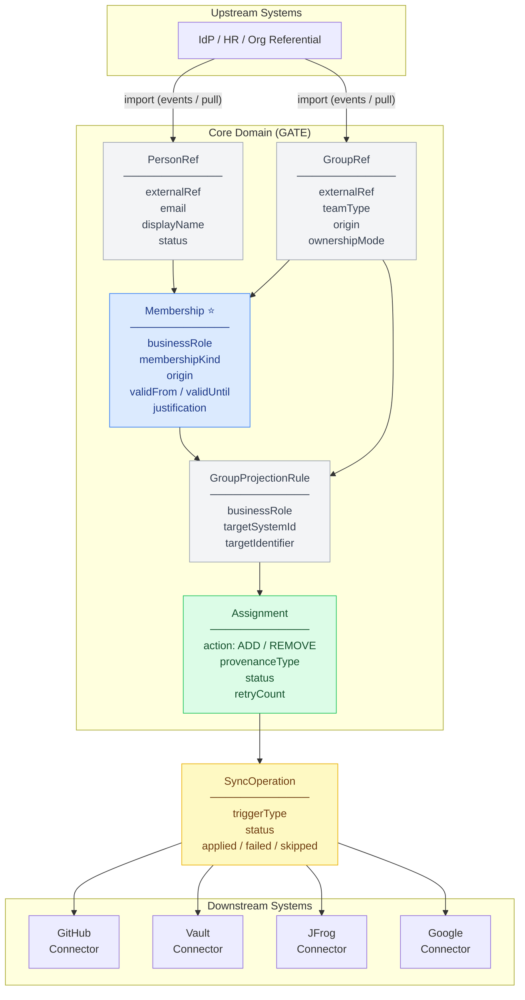

# ADR-0003: Canonical Model and Projection Architecture

## Status

`Accepted`

## Date

2026-03-24

---

## Context

Following [ADR-0001](ADR-0001-architectural-drivers-and-system-boundaries.md) (architectural drivers) and [ADR-0002](ADR-0002-source-of-truth-and-ownership-model.md) (ownership model), this ADR defines **the canonical domain model of GATE IAM** and the **architecture for projecting business affiliations into downstream target systems**.

The core design challenge is that GATE must:
1. Represent business concepts (persons, groups, memberships) in a way that is **independent of any upstream or downstream provider**
2. Translate those representations into **concrete assignments** for each target system via pluggable connectors
3. Maintain a clear boundary between **business intent** (a person belongs to a group with a role) and **technical execution** (that person must be added to a specific GitHub team, Vault policy group, or Google Group)

This ADR also documents the architecture pattern chosen to achieve this separation and extensibility.

---

## Decision Drivers

- **TD-1** — Loose coupling with upstream and downstream systems _(ADR-0001)_
- **TD-2** — Domain independence from vendor-specific concepts _(ADR-0001)_
- **TD-3** — Resilience against synchronization failures _(ADR-0001)_
- **TD-4** — Asynchronous synchronization _(ADR-0001)_
- **TD-6** — Extensible connector architecture _(ADR-0001)_
- **FD-2** — One business affiliation must project into multiple technical assignments _(ADR-0001)_
- **FD-3** — Synchronization status must be a first-class visible concept _(ADR-0001)_

---

## Considered Options

### Option A — Direct connector calls from the domain

The domain layer calls target system APIs directly (GitHub client, Vault client, etc.) when a membership changes.

**Rejected because:**
- Violates TD-1 and TD-2: vendor concepts leak into the domain
- Makes the domain untestable without live integrations
- Adding a new connector requires modifying the core

### Option B — Shared database with connectors polling

Connectors read a shared database and apply changes directly. No event bus.

**Rejected because:**
- Creates tight coupling at the data layer
- No clear audit of who applied what
- Scaling and isolation become difficult

### Option C — Event-driven projection via ports and adapters _(selected)_

The domain emits business events. An async projection engine processes these events and dispatches to connector adapters via a `TargetSystemConnector` port.

**Selected because:**
- Keeps the domain pure and testable
- Each connector is independently deployable and replaceable
- Sync failures are isolated and retryable without replaying business events
- Aligns with hexagonal architecture principles

---

## Decision

We adopt **Option C**: an event-driven, hexagonal architecture where:
- The **core domain** is a pure model with no infrastructure dependencies
- **Domain events** drive all downstream projection
- **Ports** define stable contracts between the domain and the outside world
- **Adapters** implement those contracts for specific systems

---

## The Canonical Domain Model

### Entities Overview



> **Legend:**
> - **Blue** — `Membership`: central affiliation record — may be an imported baseline or a controlled local extension
> - **Green** — `Assignment`: the computed synchronization unit (one per target system)
> - **Yellow** — `SyncOperation`: tracks the execution of a synchronization batch
> - **Grey** — Supporting entities (`PersonRef`, `GroupRef`, `GroupProjectionRule`)

---

### `PersonRef`

A minimal local projection of a person mastered by an upstream identity system.

GATE does not own the identity of this person. The `externalRef` is the stable key linking GATE's local record to the upstream record.

| Field | Type | Description |
|-------|------|-------------|
| `id` | UUID | Internal GATE identifier |
| `externalRef` | String | Identifier in the upstream system (e.g., LDAP login, HR employee ID) |
| `sourceSystem` | String | Name of the upstream system |
| `displayName` | String | Human-readable name (read from upstream, not editable in GATE) |
| `email` | String | Primary email (read from upstream) |
| `status` | Enum | `ACTIVE` \| `INACTIVE` \| `SUSPENDED` |
| `lastImportedAt` | Instant | Timestamp of the last successful import from upstream |

**Origin**: always `EXTERNAL`
**What GATE can modify**: none of the above (all are upstream-mastered)
**What GATE adds internally**: `lastImportedAt`, internal `id` used as foreign key in `Membership`

---

### `GroupRef`

A representation of a logical group (team, squad, product, scope) — either imported from an upstream referential or created locally in GATE.

| Field | Type | Description |
|-------|------|-------------|
| `id` | UUID | Internal GATE identifier |
| `externalRef` | String | Identifier in the upstream system (null if `origin=LOCAL`) |
| `sourceSystem` | String | Source system name (null if `origin=LOCAL`) |
| `name` | String | Group name (upstream-mastered if `EXTERNAL`) |
| `origin` | Enum | `EXTERNAL` \| `LOCAL` |
| `ownershipMode` | Enum | `READ_ONLY` \| `ENRICHED` \| `LOCAL_AUTHORITATIVE` |
| `teamType` | Enum | `BUSINESS_MANAGED` \| `TRANSVERSE` \| `TECHNICAL` \| `GOVERNANCE_ONLY` \| `TEMPORARY_COALITION` |
| `status` | Enum | `ACTIVE` \| `INACTIVE` \| `ARCHIVED` |
| `parentGroupRef` | UUID? | Optional reference to a parent group |
| `governanceMode` | Enum | `PASS_THROUGH` \| `ENRICHED` \| `GATE_CONTROLLED` |
| `syncPolicy` | Embedded | Configuration of synchronization behavior for this group |
| `lastImportedAt` | Instant? | Last upstream sync (null if `origin=LOCAL`) |

**`ownershipMode` vs `governanceMode` — two orthogonal dimensions:**

These two fields are independent and answer different questions:

| Field | Question | Values | Example |
|-------|----------|--------|---------|
| `ownershipMode` | **Who can write what on this entity?** | `READ_ONLY` \| `ENRICHED` \| `LOCAL_AUTHORITATIVE` | `ENRICHED` → upstream fields are read-only, but GATE may add governance metadata (GroupProjectionRule, deprovisionPolicy, governanceMode) without touching the name or externalRef |
| `governanceMode` | **How does GATE apply its projection rules on the members of this group?** | `PASS_THROUGH` \| `ENRICHED` \| `GATE_CONTROLLED` | `ENRICHED` → GATE projects imported memberships AND applies its own additional rules (local extensions, extra mappings) on top |

**`governanceMode` values:**
- `PASS_THROUGH`: GATE propagates memberships as-is, no local enrichment
- `ENRICHED`: GATE applies additional projection rules on top of imported memberships
- `GATE_CONTROLLED`: All memberships in this group are managed by GATE (applies to `LOCAL` groups)

**Invariant**: `ownershipMode=READ_ONLY` with `governanceMode=ENRICHED` is a forbidden combination — GATE cannot enrich projection rules for a group it cannot annotate. Valid combinations:

| `ownershipMode` | Permitted `governanceMode` values |
|-----------------|-----------------------------------|
| `READ_ONLY` | `PASS_THROUGH` only |
| `ENRICHED` | `PASS_THROUGH`, `ENRICHED` |
| `LOCAL_AUTHORITATIVE` | `ENRICHED`, `GATE_CONTROLLED` |

---

### `Membership`

`Membership` is the central affiliation record used by GATE to govern projection and synchronization. It may represent either an **imported baseline affiliation** (mirroring an upstream membership fact) or a **controlled local extension** (a governance decision made within GATE when the upstream system cannot express the access pattern).

GATE is the source of truth for memberships it creates (`origin=LOCAL`). For memberships imported from upstream, GATE holds a governed projection — it does not redefine their business meaning.

| Field | Type | Description |
|-------|------|-------------|
| `id` | UUID | Internal GATE identifier |
| `personId` | UUID | Reference to `PersonRef` |
| `groupId` | UUID | Reference to `GroupRef` |
| `businessRole` | String | Role as expressed by the upstream or local business context (e.g., `CONTRIBUTOR`, `OWNER`, `MEMBER`) |
| `membershipKind` | Enum | `BASELINE` \| `TRANSVERSE` \| `TEMPORARY` \| `EXCEPTION` \| `GOVERNANCE_OVERRIDE` |
| `origin` | Enum | `EXTERNAL` \| `LOCAL` |
| `sourceSystem` | String? | Source system name for imported memberships |
| `externalRef` | String? | Identifier of the **membership relationship itself** in the upstream system (not the person or group identifier) — used to detect changes and deletions on reimport, and to ensure idempotence via `(sourceSystem, externalRef)` uniqueness |
| `validFrom` | LocalDate? | Membership start date (null = no restriction) |
| `validUntil` | LocalDate? | Membership expiration date (mandatory for `TEMPORARY` and `EXCEPTION`) |
| `status` | Enum | `ACTIVE` \| `PENDING` \| `EXPIRED` \| `REVOKED` \| `SUSPENDED` |
| `justification` | String? | Required for all `LOCAL` memberships |
| `createdBy` | String? | Creator identifier (required for `LOCAL`) |
| `approvalStatus` | Enum? | `NOT_REQUIRED` \| `PENDING_APPROVAL` \| `APPROVED` \| `REJECTED` |
| `approvedBy` | String? | Approver identifier |

**Key invariants:**
- `membershipKind=TEMPORARY` requires `validUntil`
- `membershipKind=EXCEPTION` requires `justification` and `validUntil`
- `origin=LOCAL` requires `justification` and `createdBy`
- `membershipKind=BASELINE` cannot be created locally (`origin` must be `EXTERNAL`)

---

### `TargetSystem`

Represents a downstream system to which GATE synchronizes assignments.

| Field | Type | Description |
|-------|------|-------------|
| `id` | UUID | Internal GATE identifier |
| `name` | String | Human-readable name (e.g., "GitHub", "HashiCorp Vault") |
| `type` | Enum | `GITHUB` \| `VAULT` \| `JFROG` \| `GOOGLE_WORKSPACE` \| `GENERIC` |
| `connectorRef` | String | Identifies the connector adapter to use |
| `connectionConfig` | JSON | Connector-specific configuration (encrypted at rest) |
| `status` | Enum | `ENABLED` \| `DISABLED` \| `ERROR` |
| `deprovisionPolicy` | Enum | `IMMEDIATE` \| `GRACE_PERIOD` \| `MANUAL_REVIEW` |

---

### `GroupProjectionRule`

Defines how a `GroupRef` (and optionally a specific `businessRole`) maps to a concrete identifier in a `TargetSystem`.

This is the translation table between GATE's canonical model and the target system's model.

| Field | Type | Description |
|-------|------|-------------|
| `id` | UUID | Internal GATE identifier |
| `groupId` | UUID | The source `GroupRef` |
| `businessRole` | String? | If set, this mapping applies only when the member has this role |
| `targetSystemId` | UUID | The target system |
| `targetIdentifier` | String | The identifier in the target system (e.g., GitHub team slug, Vault policy name, Google Group email) |
| `targetRole` | String? | The role or access level to apply in the target system (e.g., `maintainer`, `admin`). If null, falls back to `SystemProjectionRule.defaultTargetRole` for the same `(businessRole, targetSystem)` pair. |
| `mappingType` | Enum | `DIRECT` \| `ROLE_BASED` \| `CONDITIONAL` |

**`mappingType` values:**

| Value | `businessRole` | Meaning |
|-------|---------------|---------|
| `DIRECT` | `null` | All members of the group are mapped to this `targetIdentifier` regardless of their role. Equivalent to the wildcard `businessRole=null`. |
| `ROLE_BASED` | non-null | Only members with exactly this `businessRole` are mapped to this `targetIdentifier`. A group has N `GroupProjectionRule` entries, one per role. |
| `CONDITIONAL` | n/a | Future extensibility — conditional logic based on membership attributes (`membershipKind`, `origin`, etc.). **Not implemented in MVP.** |

**Coherence rule**: `mappingType` and `businessRole` must be consistent:
- `businessRole IS NULL` → `mappingType` must be `DIRECT`
- `businessRole IS NOT NULL` → `mappingType` must be `ROLE_BASED` or `CONDITIONAL`

A `ROLE_BASED` entry with `businessRole=null` is invalid and must be rejected at the API layer.

**Example:**
- Group `Payments`, role `CONTRIBUTOR` → GitHub team `org/payments-contributors`, Vault policy `payments-write`
- Group `Payments`, role `OWNER` → GitHub team `org/payments-admins`, Vault policy `payments-admin`
- Group `Payments`, no role filter → GitHub team `org/payments` (all members, same target)

> **Scope note (initial version):** `GroupProjectionRule` is intentionally simple in this version. `mappingType=CONDITIONAL` signals future extensibility, but conditional projection logic is not part of the initial implementation. More expressive rules (conditions on `membershipKind`, `origin`, group attributes, or role transformations) may be addressed in a future ADR.

---

### `Assignment`

A computed, concrete action that GATE must apply in a target system. Generated from `Membership` + `GroupProjectionRule`. This is the **unit of synchronization**.

| Field | Type | Description |
|-------|------|-------------|
| `id` | UUID | Internal GATE identifier |
| `membershipId` | UUID | The source `Membership` |
| `personRef` | UUID | The person concerned |
| `targetSystemId` | UUID | The target system |
| `targetIdentifier` | String | The target group/policy/team identifier |
| `action` | Enum | `GRANT` \| `REVOKE` |
| `provenanceType` | Enum | `EXTERNAL_BASELINE` \| `LOCAL_EXTENSION` |
| `status` | Enum | `PENDING` \| `APPLIED` \| `FAILED` \| `SKIPPED` \| `REVOKED` |
| `projectionRuleId` | UUID? | The rule that generated this assignment |
| `lastAttemptAt` | Instant? | Timestamp of the last synchronization attempt |
| `lastSuccessAt` | Instant? | Timestamp of the last successful sync |
| `failureReason` | String? | Error details if status is `FAILED` |
| `retryCount` | Int | Number of synchronization attempts |

**Key principle:**
> A `Membership` expresses **business intent**. An `Assignment` expresses **technical execution**.
> One `Membership` may generate multiple `Assignment` records (one per target system / per `GroupProjectionRule`).

---

### `SyncOperation`

Represents a batch synchronization run — either triggered by an event, a schedule, or manually.

| Field | Type | Description |
|-------|------|-------------|
| `id` | UUID | Internal GATE identifier |
| `triggerType` | Enum | `EVENT_DRIVEN` \| `SCHEDULED` \| `MANUAL` |
| `targetSystemId` | UUID? | If scoped to one system (null = all) |
| `status` | Enum | `PENDING` \| `RUNNING` \| `COMPLETED` \| `PARTIALLY_FAILED` \| `FAILED` |
| `startedAt` | Instant | |
| `completedAt` | Instant? | |
| `totalAssignments` | Int | Total assignments processed |
| `appliedCount` | Int | Successfully applied |
| `failedCount` | Int | Failed |
| `skippedCount` | Int | Skipped (idempotent: already in correct state) |

> **Note on domain placement:** `SyncOperation` is intentionally part of the core domain rather than the application or infrastructure layer. Synchronization observability — knowing what was synced, when, and with what outcome — is a core value proposition of GATE, not implementation plumbing. These records are the basis for operational dashboards, audit trails, and drift detection.

---

## The Projection Architecture

### Hexagonal Architecture Overview

```
┌────────────────────────────────────────────────────────────────────┐
│                          CORE DOMAIN                               │
│                                                                    │
│   PersonRef  GroupRef  Membership  Assignment  GroupProjectionRule  ...  │
│                                                                    │
│   Domain Services:                                                 │
│   - MembershipLifecycleService                                    │
│   - ProjectionCalculationService                                  │
│   - ExpirationEnforcementService                                 │
│                                                                    │
│   Domain Events:                                                   │
│   - MembershipGranted        - MembershipRevoked                  │
│   - MembershipExpired        - AssignmentRequested                │
│   - GroupImported            - PersonImported                     │
│                                                                    │
├──────────────────────────────────────────────────────────────────┤
│                      APPLICATION LAYER                             │
│                                                                    │
│   Use Cases:                                                       │
│   - GrantMembership          - RevokeMembership                   │
│   - ImportGroupFromSource    - ImportPersonFromSource             │
│   - TriggerSyncForGroup      - ReviewExpiringMemberships          │
│                                                                    │
├──────────────────────────────────────────────────────────────────┤
│                        PORTS (interfaces)                          │
│                                                                    │
│   Inbound:                    Outbound:                           │
│   - AdminApiPort              - TargetSystemConnector             │
│   - EventListenerPort         - UpstreamSourceGateway            │
│                               - EventPublisherPort                │
│                               - NotificationPort                  │
│                               - AuditLogPort                     │
└──────────────────────────────────────────────────────────────────┘
         ▲              ▲                  │                │
         │              │                  ▼                ▼
 ┌───────────┐  ┌──────────────┐  ┌──────────────┐  ┌──────────────┐
 │ REST API  │  │ Source       │  │  GitHub      │  │  Vault       │
 │ Adapter   │  │ Connector    │  │  Connector   │  │  Connector   │
 │           │  │ (HR, Org...) │  │  Adapter     │  │  Adapter     │
 └───────────┘  └──────────────┘  └──────────────┘  └──────────────┘
```

---

### Projection Flow

The lifecycle of a membership from grant to synchronization:

```
1. [Trigger] A membership is granted (API call or upstream event)
       │
       ▼
2. [Domain] Membership entity created, validated, persisted
   Domain event emitted: MembershipGranted
       │
       ▼
3. [Application] ProjectionCalculationService processes the event:
   - Finds all GroupProjectionRules for the group + businessRole
   - Generates one Assignment per (targetSystem, targetIdentifier)
       │
       ▼
4. [Domain event] AssignmentRequested emitted per Assignment
       │
       ▼
5. [Async] SyncOperation created for each target system
       │
       ▼
6. [Adapter] TargetSystemConnector.apply(Assignment) called per target system
   - GitHub Connector: add person to team `org/payments-contributors`
   - Vault Connector: add person to policy `payments-write`
       │
       ▼
7. [Result] Assignment.status updated: APPLIED or FAILED
   SyncOperation updated with counts
       │
       ▼
8. [Audit] AuditLogPort records the projection event with full provenance
```

---

### Reconciliation Model

The event-driven flow above covers the **responsive path**: an assignment is created or revoked in near real-time when a membership changes. However, event-driven projection alone is insufficient for long-term consistency.

Target systems may:
- experience temporary outages, causing assignments to fail or be missed
- be modified externally, creating drift between GATE's view and the actual state
- miss events during initial setup, recovery, or infrastructure gaps

GATE therefore combines two complementary mechanisms:

| Mechanism | Purpose | Trigger |
|-----------|---------|--------|
| **Event-driven projection** | Responsiveness — react to membership changes in near real-time | Domain event (`MembershipGranted`, `MembershipRevoked`, `MembershipExpired`) |
| **Scheduled reconciliation** | Convergence — detect and correct drift regardless of event history | Periodic scheduler (configurable interval per `TargetSystem`) |

**Reconciliation process:**
1. Compute the **expected state**: all active `Membership` records + their `GroupProjectionRule` → expected `Assignment` set
2. Query the **actual state** from the target system via `TargetSystemConnector`
3. Compute the **delta**: assignments to grant, to revoke, or already in sync (`NO_OP`)
4. Apply the delta and record results as `Assignment` records with `triggerType=RECONCILIATION`

This ensures GATE's projection remains **eventually consistent** with target systems even in the presence of failures, external modifications, or missed events.

---

### `TargetSystemConnector` Port

The outbound port that all target system adapters must implement:

```java
// Outbound port — defined in the domain/application layer
public interface TargetSystemConnector {

    String systemType();

    ProvisioningResult apply(Assignment assignment, PersonRef person);

    ProvisioningResult revoke(Assignment assignment, PersonRef person);

    boolean isHealthy();
}
```

This is the **only way** the domain layer interacts with downstream systems. No GitHub, Vault, or Jfrog types ever appear in the domain.

---

### `UpstreamSourceGateway` Port

An **outbound** port called by the application layer to fetch organizational data from upstream systems. The implementation lives in `infrastructure/connector/source/`. The domain never calls this port directly — it is invoked by import use cases in the application layer.

```java
// Outbound port — called by import use cases, implemented by source adapters
public interface UpstreamSourceGateway {

    String sourceSystem();

    List<PersonRef> fetchPersons();

    List<GroupRef> fetchGroups();

    List<MembershipRef> fetchMemberships();
}
```

The corresponding inbound use cases (which orchestrate calls to this gateway) are:

- `ImportPersonsFromSourceUseCase`
- `ImportGroupsFromSourceUseCase`
- `HandleUpstreamMembershipChangedUseCase`

---

### Domain Events

All events are immutable value objects. They carry the minimal information needed to trigger downstream reactions.

| Event | Published when | Consumed by |
|-------|---------------|-------------|
| `MembershipGranted` | A membership becomes `ACTIVE` | ProjectionCalculationService |
| `MembershipRevoked` | A membership is revoked by an operator | ProjectionCalculationService |
| `MembershipExpired` | Expiration engine detects `validUntil` passed | ProjectionCalculationService |
| `PersonImported` | A person is synced from an upstream source | Internal reference update |
| `GroupImported` | A group is synced from an upstream source | Internal reference update |
| `AssignmentRequested` | A new Assignment is computed | SyncDispatchService |
| `AssignmentApplied` | A connector confirms success | AuditLogPort |
| `AssignmentFailed` | A connector returns a failure | Retry policy, alerting |

---

## Package Structure (Java / Spring Boot)

> **Note:** The structure below is indicative for the initial implementation. It reflects the hexagonal architecture principles described in this ADR but should not be treated as a frozen constraint. Package organization may evolve as bounded contexts and vertical slices become clearer during development.

```
gate-iam-backend/
└── src/main/java/io/gate/iam/
    ├── domain/
    │   ├── model/
    │   │   ├── person/          # PersonRef, PersonStatus
    │   │   ├── group/           # GroupRef, TeamType, GovernanceMode
    │   │   ├── membership/      # Membership, MembershipKind, MembershipStatus
    │   │   ├── assignment/      # Assignment, AssignmentAction, ProvenanceType
    │   │   ├── projection/      # GroupProjectionRule, SystemProjectionRule, MappingType
    │   │   └── sync/            # SyncOperation, SyncStatus
    │   ├── event/               # Domain events (MembershipGranted, etc.)
    │   └── port/
    │       ├── outbound/        # TargetSystemConnector, UpstreamSourceGateway, AuditLogPort, EventPublisherPort
    │       └── inbound/         # AdminApiPort (use case interfaces exposed to the REST layer)
    │
    ├── application/
    │   ├── usecase/             # GrantMembership, RevokeMembership, ImportGroupsFromSource, ...
    │   └── service/             # ProjectionCalculationService, ExpirationEnforcementService
    │
    └── infrastructure/
        ├── persistence/         # JPA repositories
        ├── api/                 # REST controllers (AdminApiPort implementation)
        ├── connector/
        │   ├── github/          # GitHub TargetSystemConnector adapter
        │   ├── vault/           # Vault TargetSystemConnector adapter
        │   ├── jfrog/           # JFrog TargetSystemConnector adapter
        │   ├── google/          # Google Workspace TargetSystemConnector adapter
        │   └── source/          # UpstreamSourceGateway implementations
        └── event/               # Event bus adapter (Kafka, in-memory, etc.)
```

**Key rule:** The `domain/` package has **zero dependency** on `infrastructure/`. It only depends on `domain/port/` interfaces. Spring annotations are only present in `infrastructure/` and optionally `application/`.

---

## Consequences

### Positive

- Full testability of the domain without any running infrastructure
- Adding a new target system = implementing `TargetSystemConnector` in a new `infrastructure/connector/xyz/` package; zero domain change
- Domain events create a natural audit trail
- Projection failures are isolated per target system — a Vault outage does not affect GitHub synchronization
- The model clearly separates intent (`Membership`) from execution (`Assignment`)

### Negative / Trade-offs

- Higher initial complexity than a direct CRUD approach
- Port and adapter pattern requires discipline to maintain; shortcuts are tempting
- Asynchronous sync introduces eventual consistency: a membership may be `ACTIVE` in GATE before it is `APPLIED` in all target systems

### Risks

- **Assignment proliferation**: A large organization with many groups and many target systems may generate a very high volume of `Assignment` records. Mitigation: pagination, archiving of completed assignments, index strategy on `status` and `targetSystemId`.
- **Event ordering**: If domain events are processed out of order (e.g., `MembershipRevoked` before `MembershipGranted`), inconsistent states may arise. Mitigation: idempotent connector operations, status state machine with guards.

---

## Related ADRs

- [ADR-0001](ADR-0001-architectural-drivers-and-system-boundaries.md) — Architectural Drivers and System Boundaries
- [ADR-0002](ADR-0002-source-of-truth-and-ownership-model.md) — Source of Truth and Ownership Model
