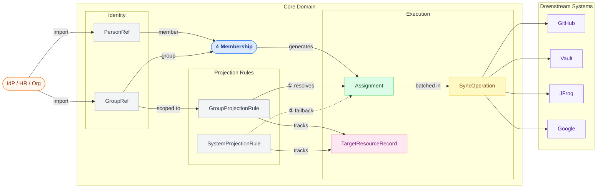

# Domain Model Reference

Complete entity reference for developers working on GATE IAM.

> **Source of truth**: [ADR-0003](../adr/ADR-0003-canonical-model-and-projection-architecture.md), [ADR-0004](../adr/ADR-0004-role-mapping-resolution-strategy.md), [ADR-0005](../adr/ADR-0005-downstream-resource-lifecycle-management.md).

---

## Entity Overview

| Entity | Role |
|--------|------|
| `PersonRef` | Local mirror of an upstream identity |
| `GroupRef` | Group / team — imported or created locally |
| `Membership` | **Central**: a person belongs to a group with a business role |
| `TargetSystem` | A downstream system receiving access assignments |
| `GroupProjectionRule` | Group-scoped override: `(group, businessRole, targetSystem) → targetIdentifier + targetRole?` |
| `SystemProjectionRule` | System-level default: `(targetSystem, businessRole) → defaultTargetRole + template?` |
| `Assignment` | Computed synchronisation unit — one per `(membership, targetSystem, rule)` |
| `SyncOperation` | Batch synchronisation tracking record |
| `TargetResourceRecord` | Lifecycle state of a downstream resource `(group, targetSystem)` |

---

## Entity Diagram



> **Légende :**
> - **Bleu** — `Membership` : enregistrement d'affiliation central
> - **Vert** — `Assignment` : unité de synchronisation calculée (une par système cible)
> - **Jaune** — `SyncOperation` : suivi d'un batch de synchronisation
> - **Rose** — `TargetResourceRecord` : cycle de vie de la ressource downstream
> - **Gris** — entités de support (`PersonRef`, `GroupRef`, `GroupProjectionRule`, `SystemProjectionRule`)

---

## `PersonRef`

A minimal local projection of a person mastered by an upstream identity system. GATE does not own identity.

| Field | Type | Description |
|-------|------|-------------|
| `id` | UUID | Internal GATE identifier |
| `externalRef` | String | Identifier in the upstream system (LDAP login, HR employee ID) |
| `sourceSystem` | String | Name of the upstream system |
| `displayName` | String | Human-readable name (read-only, upstream-mastered) |
| `email` | String | Primary email address (read-only, upstream-mastered) |
| `status` | Enum | `ACTIVE` \| `INACTIVE` \| `SUSPENDED` |
| `lastImportedAt` | Instant | Timestamp of the last successful import from upstream |

**Invariant**: no field is writable by GATE operators; all changes flow from the upstream import.

---

## `GroupRef`

A logical group (team, squad, product, scope) — either imported from upstream or created locally in GATE.

| Field | Type | Description |
|-------|------|-------------|
| `id` | UUID | Internal GATE identifier |
| `externalRef` | String? | Identifier in the upstream system (`null` if `origin=LOCAL`) |
| `sourceSystem` | String? | Source system name (`null` if `origin=LOCAL`) |
| `name` | String | Group name (upstream-mastered if `EXTERNAL`) |
| `slug` | String | URL-safe identifier used in template resolution |
| `origin` | Enum | `EXTERNAL` \| `LOCAL` |
| `ownershipMode` | Enum | `READ_ONLY` \| `ENRICHED` \| `LOCAL_AUTHORITATIVE` |
| `teamType` | Enum | `BUSINESS_MANAGED` \| `TRANSVERSE` \| `TECHNICAL` \| `GOVERNANCE_ONLY` \| `TEMPORARY_COALITION` |
| `status` | Enum | `ACTIVE` \| `INACTIVE` \| `ARCHIVED` |
| `parentGroupRef` | UUID? | Optional parent group |
| `governanceMode` | Enum | `PASS_THROUGH` \| `ENRICHED` \| `GATE_CONTROLLED` |
| `syncPolicy` | Embedded | Synchronisation behaviour configuration |
| `lastImportedAt` | Instant? | Last upstream sync (`null` if `origin=LOCAL`) |

### `ownershipMode` vs `governanceMode` — two orthogonal dimensions

These fields answer independent questions:

| Field | Question answered | Values |
|-------|-------------------|--------|
| `ownershipMode` | **Who can write what on this entity?** | `READ_ONLY` — all fields are upstream-mastered, GATE cannot modify them. `ENRICHED` — upstream fields are read-only but GATE may add governance metadata (projection rules, policies). `LOCAL_AUTHORITATIVE` — GATE owns this group entirely. |
| `governanceMode` | **How does GATE apply projection rules to members of this group?** | `PASS_THROUGH` — propagate memberships as-is, no local enrichment. `ENRICHED` — project imported memberships AND apply additional GATE rules on top. `GATE_CONTROLLED` — all memberships managed by GATE (applies to `LOCAL` groups). |

**Valid combinations:**

| `ownershipMode` | Permitted `governanceMode` values |
|-----------------|-----------------------------------|
| `READ_ONLY` | `PASS_THROUGH` only |
| `ENRICHED` | `PASS_THROUGH`, `ENRICHED` |
| `LOCAL_AUTHORITATIVE` | `ENRICHED`, `GATE_CONTROLLED` |

**Invariant**: `ownershipMode=READ_ONLY` with `governanceMode=ENRICHED` is forbidden — GATE cannot enrich projection rules for a group it cannot annotate.

---

## `Membership`

The **central affiliation record**. Represents either an imported upstream membership fact or a controlled local extension created within GATE.

| Field | Type | Description |
|-------|------|-------------|
| `id` | UUID | Internal GATE identifier |
| `personId` | UUID | Reference to `PersonRef` |
| `groupId` | UUID | Reference to `GroupRef` |
| `businessRole` | String | Role from upstream or local business vocabulary (e.g., `CONTRIBUTOR`, `OWNER`, `MEMBER`) |
| `membershipKind` | Enum | `BASELINE` \| `TRANSVERSE` \| `TEMPORARY` \| `EXCEPTION` \| `GOVERNANCE_OVERRIDE` |
| `origin` | Enum | `EXTERNAL` \| `LOCAL` |
| `sourceSystem` | String? | Source system name (for imported memberships) |
| `externalRef` | String? | Identifier of the membership relationship itself in the upstream system — used for idempotent reimport via `(sourceSystem, externalRef)` uniqueness |
| `validFrom` | LocalDate? | Start date (`null` = no restriction) |
| `validUntil` | LocalDate? | Expiration date (mandatory for `TEMPORARY` and `EXCEPTION`) |
| `status` | Enum | `ACTIVE` \| `PENDING` \| `EXPIRED` \| `REVOKED` \| `SUSPENDED` |
| `justification` | String? | Required for all `LOCAL` memberships |
| `createdBy` | String? | Creator identifier (required for `LOCAL`) |
| `approvalStatus` | Enum? | `NOT_REQUIRED` \| `PENDING_APPROVAL` \| `APPROVED` \| `REJECTED` |
| `approvedBy` | String? | Approver identifier |

**Key invariants:**
- `membershipKind=TEMPORARY` requires `validUntil`
- `membershipKind=EXCEPTION` requires `justification` and `validUntil`
- `origin=LOCAL` requires `justification` and `createdBy`
- `membershipKind=BASELINE` cannot be created locally (`origin` must be `EXTERNAL`)

---

## `TargetSystem`

A downstream system to which GATE synchronises assignments.

| Field | Type | Description |
|-------|------|-------------|
| `id` | UUID | Internal GATE identifier |
| `name` | String | Human-readable name |
| `type` | Enum | `GITHUB` \| `VAULT` \| `JFROG` \| `GOOGLE_WORKSPACE` \| `GENERIC` |
| `connectorRef` | String | Identifies the connector adapter to use |
| `connectionConfig` | JSON | Connector-specific configuration (encrypted at rest) |
| `status` | Enum | `ENABLED` \| `DISABLED` \| `ERROR` |
| `deprovisionPolicy` | Enum | `IMMEDIATE` \| `GRACE_PERIOD` \| `MANUAL_REVIEW` |
| `decommissionPolicy` | Enum | `MEMBERS_REVOKED_RESOURCE_PRESERVED` \| `RESOURCE_DESTROYED` |

---

## `GroupProjectionRule`

Group-scoped override: maps a `(groupId, businessRole, targetSystemId)` triplet to a concrete resource identifier (and optionally a target role) in a downstream system.

| Field | Type | Description |
|-------|------|-------------|
| `id` | UUID | Internal GATE identifier |
| `groupId` | UUID | The source `GroupRef` |
| `businessRole` | String? | If set, applies only when the member has this role. `null` = wildcard (all roles). |
| `targetSystemId` | UUID | The target system |
| `targetIdentifier` | String | Exact identifier in the target system (e.g., GitHub team slug, Vault policy name) |
| `targetRole` | String? | The role to apply in the target system. If `null`, falls back to `SystemProjectionRule.defaultTargetRole` for the same `(businessRole, targetSystem)` pair. |
| `mappingType` | Enum | `DIRECT` \| `ROLE_BASED` \| `CONDITIONAL` |

**`mappingType` values:**

| Value | `businessRole` | Meaning |
|-------|---------------|---------|
| `DIRECT` | `null` | All members, regardless of role → same `targetIdentifier` |
| `ROLE_BASED` | non-null | Only members with exactly this `businessRole` |
| `CONDITIONAL` | n/a | Future: conditional logic on membership attributes (not in MVP) |

**`targetRole` fallback rule:**
```
GroupProjectionRule.targetRole is not null → use it
  else → find SystemProjectionRule for (targetSystemId, businessRole)
         if found → use SystemProjectionRule.defaultTargetRole
         else → ProjectionSkipped (NO_TARGET_ROLE_FOUND)
```

**Coherence invariant**: `businessRole IS NULL` → `mappingType` must be `DIRECT`. `businessRole IS NOT NULL` → `mappingType` must be `ROLE_BASED` or `CONDITIONAL`.

---

## `SystemProjectionRule`

System-level default projection: maps a `(targetSystem, businessRole)` pair to a default target role and an optional resource naming template. Applies to all groups unless overridden by a `GroupProjectionRule`.

| Field | Type | Description |
|-------|------|-------------|
| `id` | UUID | Internal GATE identifier |
| `targetSystemId` | UUID | The target system this default applies to |
| `businessRole` | String | The business role value to match |
| `defaultTargetRole` | String | The role to apply in the target system (e.g., `member`, `read-only`, `maintainer`) |
| `targetIdentifierTemplate` | String? | Template for computing `targetIdentifier` when no `GroupProjectionRule` exists (e.g., `org/{groupSlug}-{defaultTargetRole}`) |
| `active` | Boolean | Whether this rule is currently active |

**Template variables:**

| Variable | Source | Example |
|----------|--------|---------|
| `{groupId}` | `GroupRef.id` | `a1b2c3d4-...` |
| `{groupSlug}` | `GroupRef.slug` | `payments` |
| `{groupName}` | `GroupRef.name` | `Payments Team` |
| `{groupExternalRef}` | `GroupRef.externalRef` | `GRP-042` |
| `{defaultTargetRole}` | `SystemProjectionRule.defaultTargetRole` | `engineers` |
| `{targetSystemSlug}` | `TargetSystem.slug` | `github` |

**Note**: if `targetIdentifierTemplate` is `null` and no `GroupProjectionRule` exists for a given group, no `Assignment` is generated even if the `SystemProjectionRule` matches.

---

## `Assignment`

A computed, concrete action GATE must apply in a target system. Generated by `ProjectionCalculationService` from `Membership` + projection rules. This is the **unit of synchronisation**.

> A `Membership` expresses **business intent**. An `Assignment` expresses **technical execution**. One `Membership` may generate multiple `Assignment` records (one per matching `(targetSystem, rule)` pair).

| Field | Type | Description |
|-------|------|-------------|
| `id` | UUID | Internal GATE identifier |
| `membershipId` | UUID | The source `Membership` |
| `personRef` | UUID | The person concerned |
| `targetSystemId` | UUID | The target system |
| `targetIdentifier` | String | The resolved resource identifier in the target system |
| `targetRole` | String | The resolved role to apply |
| `action` | Enum | `GRANT` \| `REVOKE` |
| `projectionSource` | Enum | `GROUP_PROJECTION_RULE` \| `SYSTEM_PROJECTION_RULE` \| `WILDCARD_PROJECTION_RULE` |
| `projectionRuleRef` | UUID? | ID of the rule that produced this assignment |
| `provenanceType` | Enum | `EXTERNAL_BASELINE` \| `LOCAL_EXTENSION` |
| `status` | Enum | `PENDING` \| `APPLIED` \| `FAILED` \| `SKIPPED` \| `REVOKED` |
| `lastAttemptAt` | Instant? | Timestamp of the last synchronisation attempt |
| `lastSuccessAt` | Instant? | Timestamp of the last successful sync |
| `failureReason` | String? | Error details when `status=FAILED` |
| `retryCount` | Int | Number of synchronisation attempts |

---

## `SyncOperation`

Represents a batch synchronisation run — event-driven, scheduled, or manual.

| Field | Type | Description |
|-------|------|-------------|
| `id` | UUID | Internal GATE identifier |
| `triggerType` | Enum | `EVENT_DRIVEN` \| `SCHEDULED` \| `MANUAL` \| `RESOURCE_PROVISIONING` \| `RESOURCE_DECOMMISSION` |
| `targetSystemId` | UUID? | Scoped to one system (`null` = all) |
| `status` | Enum | `PENDING` \| `RUNNING` \| `COMPLETED` \| `PARTIALLY_FAILED` \| `FAILED` |
| `startedAt` | Instant | |
| `completedAt` | Instant? | |
| `totalAssignments` | Int | Total assignments processed |
| `appliedCount` | Int | Successfully applied |
| `failedCount` | Int | Failed |
| `skippedCount` | Int | Skipped (already in correct state) |

---

## `TargetResourceRecord`

Tracks the provisioning lifecycle of a downstream resource for a `(GroupRef, TargetSystem)` pair. GATE must ensure a resource is `ACTIVE` before applying any `Assignment` to it.

| Field | Type | Description |
|-------|------|-------------|
| `id` | UUID | Internal GATE identifier |
| `groupId` | UUID | The `GroupRef` this resource represents |
| `targetSystemId` | UUID | The downstream system |
| `targetIdentifier` | String | The resolved identifier used in the downstream system |
| `lifecycleState` | Enum | `PENDING_PROVISIONING` \| `ACTIVE` \| `PENDING_DECOMMISSION` \| `DECOMMISSIONED` \| `TAKEOVER` |
| `provisionedAt` | Instant? | When GATE first created or confirmed the resource |
| `decommissionedAt` | Instant? | When GATE decommissioned the resource |
| `decommissionPolicy` | Enum | `MEMBERS_REVOKED_RESOURCE_PRESERVED` \| `RESOURCE_DESTROYED` |
| `lastSyncOperationId` | UUID? | Last `SyncOperation` that touched this record |

**Lifecycle state machine:**

```
PENDING_PROVISIONING
        │
        ▼
     ACTIVE ◀── TAKEOVER (resource pre-existed in downstream system)
        │
        │  (group deactivated or mapping removed — after deprovisionPolicy converges)
        ▼
PENDING_DECOMMISSION
        │
        ▼
  DECOMMISSIONED
```

**`deprovisionPolicy` vs `decommissionPolicy` — two distinct policies:**

| Policy | Defined on | Controls | Values |
|--------|-----------|----------|--------|
| `deprovisionPolicy` | `TargetSystem`, `GroupRef` | **Speed** of membership revocation when a person/group is deactivated | `IMMEDIATE` \| `GRACE_PERIOD` \| `MANUAL_REVIEW` |
| `decommissionPolicy` | `TargetSystem`, `GroupProjectionRule` | **Fate of the downstream resource** once GATE stops governing it | `MEMBERS_REVOKED_RESOURCE_PRESERVED` \| `RESOURCE_DESTROYED` |

**Sequencing invariant**: `decommissionPolicy` only applies *after* `deprovisionPolicy` has fully converged for all members. GATE does not evaluate resource decommission until all pending member revocations have reached a terminal state.
